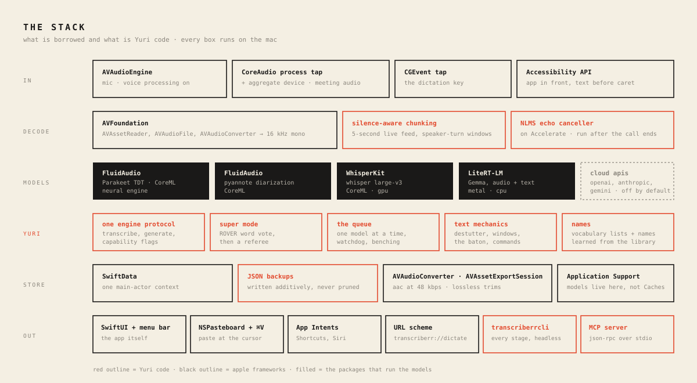

# What I Learned Building a Fully Local Transcriber for macOS

*Transcriberr is a native macOS app: record, transcribe, diarize, rewrite — all on-device. No audio leaves the Mac. Building it was hard in places I didn't expect. Here's what broke, and what held.*

## The shape of the machine

The map first. One pipeline, every recording. Every lesson below lives at one of these stations:

## Hardship #1: The model that lied convincingly

The first build used one multimodal model for everything: Gemma via MLX, audio in, text out. The demo looked great. Then it transcribed a business meeting as a conversation about music production. That conversation never happened. Fluent, confident, invented.

The rule that saved me: **isolate the layer before you blame it.** From the transcript view, a hallucinating model and a broken mic pipeline look identical. So prove layers one at a time. Headless CLI, test tone: 151 dB SNR — recorder healthy. Decode healthy. Which leaves the model — and there it was: the 8-bit quantized audio tower was degraded. Same Gemma through Google's LiteRT-LM runtime, the stack already proven on Android: word-perfect. Same weights, different runtime, opposite result.

You don't integrate a model. You integrate a model-runtime pair.

## Hardship #2: A small model cannot copy

Post-processing — cleanup, rewrite, translation — runs on a small on-device LLM. The prompt said: remove stutters, keep every sentence, copy speaker labels exactly. The model obeyed for about two thousand characters. Then "Yuri:" became "uri:", stutters passed straight through, and by minute 27 whole phrases were falling out: "Have weekend. Have great. Bye."

No prompt fixes this, because it isn't comprehension — it's attention arithmetic. Picture a monk copying a manuscript. Page one is immaculate. Page forty, letters fall off names and clauses vanish. Sterner instructions don't help the monk. One page at a time does. So, three moves:

1. **Mechanics in code, not in the model.** A deterministic pass collapses "for for for for", phrase echoes, and fillers before the model sees text. Measured on real recordings: 371 fillers → 0. 29 triple-stutters → 0. Code doesn't drift and costs nothing. The sieve before the chef.
2. **Short outputs only.** Rewrites run per speaker-turn window, ~2,600 characters, then stitch.
3. **Pass the baton.** Each window's prompt opens with the tail of the previous *processed* window. A relay runner takes the baton at full stride because she watched the last twenty meters. Names, spellings, and sentence flow survive the seams.

A failed window keeps its source text — content can't be lost, only left unpolished. And the local engine is one chef in one kitchen, so generations queue FIFO. I let two cooks share the stove once. The plate came back empty.

The rule: prompt for judgment, code for mechanics, chunk everything.

## Hardship #3: The platform fights back quietly

Four macOS incidents. Zero useful errors at the moment of the mistake.

- **~/Library/Caches is not storage.** macOS purged a 10 GB model mid-week, silently. Models live in Application Support now.
- **SwiftData contexts don't share news.** Writes on one ModelContext are invisible to reads on another. Deletes that didn't delete. Restores that didn't restore. Branch offices with separate notebooks: each internally consistent, company books wrong. The fix was structural — one main-actor context, a single ledger. A whole bug class became a compile-time rule.
- **Signatures must agree.** Google ships its LiteRT dylib signed with Google's Team ID. Ad-hoc app + Google-signed dylib runs fine from Xcode — and dies at launch as a packaged build, because dyld refuses to pair binaries from different teams. One `codesign --force -s -` per dylib, scripted into packaging.
- **A recorder can be perfect and invisible.** Meeting capture worked on day one. Its timer showed 00:00 forever — the class wasn't observable, so SwiftUI never re-rendered. Audio code earns trust by drawing a waveform.

## Architectural notes — what paid off

### Engines are a protocol, quality is a tournament

Every engine — Parakeet on the Neural Engine, Whisper large-v3, Gemma — implements one small protocol: `transcribeChunk`, `generateText`, capability flags. That's why versioned transcripts cost almost nothing to build: every run is snapshotted, engines race on the same audio, you review the photo finish. It's also how I settled "is it better than a Samsung S24?" — side by side, per recording, not by vibes.

The scoreboard, concretely: two real recordings, 28 and 42 minutes, same audio to both devices. Seven domain terms tracked — a company, a product, two cities, a security standard, a cloud platform, a meeting type. Transcriberr in Super mode: **7/7 exact**. Samsung: **2/7** — a European city came back as a country at war, a container platform became a word that doesn't exist, a company name turned into a cleaning product, and a "dev call" became "deaf calls". Where Samsung won: turn grouping — 39 clean speaker turns against my 115 fragments on the long file. That gap became a setting (speaker-turn gap, default 30 s), not a redesign.

### Super mode: two stenographers and an editor-in-chief

Super mode = two engines + a merge (ROVER-style). Two court stenographers type the same hearing. An editor lays the tapes side by side and slides them until the words line up — that's the alignment. Then, per word:

- Same word → straight into the record.
- Different words → the surer stenographer wins. Per-word confidence decides.
- Real dispute — one heard "OWASP", the other "a wasp" — goes to the editor-in-chief who has read the whole case file: the local LLM, given the surrounding transcript. He rules.

The bug that taught me the design: my first merge rubber-stamped anything that *looked* similar — and threw away the one word only Whisper caught, "OWASP 10". So: verbatim shortcuts only at near-certainty. Everything else gets a vote.

### Meeting mode: plug into the soundboard

Recording a call with a mic pointed at the speakers is bootleg concert taping. The engineer's move: plug into the soundboard. macOS 14.4+ lets an app tap what other apps play — digitally, before it ever becomes sound. That tap plus the mic go into one aggregate device: single clock, drift-compensated. Two metronomes, one conductor. Downmix, 16 kHz, same WAV as every recording.

Which means meetings inherit transcription, diarization, versions, and presets for free. New capture layer, untouched pipeline.

### A CLI harness that runs the app's real code

Every stage — record, decode, transcribe, diarize — runs headlessly through the same classes the GUI uses. Nearly every hard bug fell to the CLI, not to clicking around. If a pipeline is only testable through its UI, it isn't debuggable.

### Vocabulary as data, harvested from life

Names decide whether you trust a transcript. The app keeps per-language vocabulary lists — injected into ASR prompts and every rewrite — bootstrapped from my own files and past transcripts. My folder names beat any model's guess.

### Adversarial review before every release

Twice before shipping, an independent review pass attacked the newest code with orders to break it. Twice it found real bugs the happy path hides: a double-press race saving duplicate recordings, a frozen meeting timer, a queue that one wedged generation could block forever, a cleanup pass quietly deleting sentence boundaries. Today's code deserves a hostile reader today — while the design is still soft.

## The one-line summary

Local-first AI is not cloud AI, smaller. It's a different discipline: prove each layer with evidence, let deterministic code do everything it can, give the model only short, judgment-shaped work — and never trust a demo.

## Part two: the log

Part one went up in August. What follows is the month after it, taken from the commit messages and cut down.

The middle of the map is the August pipeline. Dictation goes from the key straight to Parakeet and skips it: no decoder, no chunking, no diarization. The knowledge base reads the store. The queue under the engines runs one model at a time, because two models running at once made Gemma hang.

### The stack

Audio comes in through AVAudioEngine for the microphone, with Apple's voice processing on, and for meetings through a CoreAudio process tap joined to the mic in one aggregate device. The dictation key is a CGEvent tap. The app in front, the kind of field and the text before the caret come from the Accessibility API. Decoding is AVFoundation: AVAssetReader where it works, AVAudioFile and AVAudioConverter where it refuses, always down to 16 kHz mono.

The models come through three packages. FluidAudio carries Parakeet, a CoreML build of Nvidia's TDT model that runs on the Neural Engine, and the pyannote diarization pipeline, also CoreML. WhisperKit carries whisper large-v3 as CoreML on the GPU. LiteRT-LM, Google's runtime, carries Gemma for audio and text on Metal. The cloud backends for OpenAI, Anthropic and Gemini are in the code behind an API key and off by default.

The Yuri code sits around the models: the engine protocol every backend implements; the Super-mode word vote and the arbitration pass; the queue, its watchdog and its benching; the NLMS echo canceller on Accelerate; the destutter pass, the chunk windows and the carried-over context between them; the vocabulary lists and the harvester that learns names from the library, using NaturalLanguage to tell a name from a capitalised ordinary word. Storage is SwiftData behind one main-actor context, plain JSON backups written additively, AAC through AVAudioConverter with lossless trims through AVAssetExportSession, and models in Application Support. The ways out: the SwiftUI app and its menu bar item, NSPasteboard plus a synthetic ⌘V, App Intents for Shortcuts and Siri, a URL scheme, the headless CLI that runs every stage, and the MCP server, JSON-RPC over stdio. Two non-Swift pieces: an Objective-C try/catch shim, because Swift's do/catch cannot catch the NSException AVAudioEngine throws and the app used to abort on the record button; and an IOKit power assertion so the Mac does not sleep during a long transcription.

### Meeting mode

Live captions now run for meeting recordings as well as plain ones. Both recorders emit the same five-second chunk feed and the live transcriber attaches to whichever one starts. The meeting recorder measures mic energy against system-tap energy per IO cycle, before the downmix, and saves the intervals where the mic dominates. After transcription, the speaker that best overlaps those intervals gets my name. The speaker-count stepper now reaches the diarizer; it had been dropped on the way.

Alongside the mixed file, meeting mode writes the raw mic track and the raw system track. When both exist, transcription runs them as two chunk streams on one timeline. Mic segments are me. Diarization runs only on the system track, with one speaker fewer since I counted myself. An echo guard drops mic segments that duplicate a system segment at the same time.

### Speakers, echo, the 25-minute Super run, and the empty summaries

The speaker count became a maximum. Forcing an exact cluster count manufactured phantom speakers when fewer people talked. A system-track cluster that carries my own name is the platform's echo of my voice and folds into me.

Echo, first pass: while the system tap is loud and the mic is not dominant, the mic's contribution to the mix is attenuated to 12% with 40 ms smoothing, so the far side no longer arrives twice, once digitally and once through the room. Then the duck became a full gate, and then an offline NLMS canceller, run against the raw tracks after the recording stops. Measured: 11.8 dB off the echo, 0.2 dB off speech. A sentence-level scrub catches what the canceller leaves at speaker turns, with fuzzy token matching, because echo degrades "schedule" into "scheduled".

Super mode, measured on a real 52-minute meeting: the sequential max-quality run took 24:59. 221 of 226 chunks agreed between the engines and never reached arbitration. The sequential constraint bought context for five decisions and cost twenty minutes on 226. New design: the first pass runs three chunks wide with the vote only, and disputed chunks, agreement under 0.8, get a second sequential pass in which Gemma arbitrates with transcript context from both sides plus the vocabulary.

The test suite went from 16 to 41 and caught three bugs on the way: "yes yes" as deliberate emphasis was being collapsed as a stutter, the version dedup checked only the relationship array, and a boundary trim was deleting sentence ends. A CLI run command executes the full pipeline headlessly on real recordings before a deploy.

The empty summaries. The log showed that every zero-character response coincided with a Gemma merge running at the same moment. Swift actors are reentrant at await: an ensemble arbitration and a preset generation had interleaved two conversations on the single LiteRT engine, and one starved. A non-reentrant FIFO lock now guards the text and audio paths. The lock then deadlocked: when a LiteRT inference hung, the task holding the lock never ran its defer, so the lock stayed held and every later call queued behind it. The lock is now generation-stamped and resets when the engine is rebuilt, so waiters resume against the fresh engine and the hung task's eventual release is a no-op. The watchdog rebuilds the wedged Gemma engine in place instead of tearing down the whole ensemble under in-flight chunks. A chunk that wedges twice is skipped. The dispute loop got a 120-second timeout per arbitration and a cap: the worst ten disputes by agreement are arbitrated, the rest keep the vote. Pairs from different model families dispute about 70% of chunks on Ukrainian.

### Error 3, the JSON flake, and Ukrainian

"Error 3" in the log was the chunk timeout, not "backend unavailable". Foundation does not number the cases of a payload-less Swift enum in declaration order. Two releases went to the wrong failure. The max-quality first pass had a bare 300-second timeout and no recovery; it now recovers, retries, degrades to the healthy engine, and after two wedges in a run Gemma sits out the rest. In a sweep of all six engine pairs on the same Ukrainian meeting, Gemma wedged in every pairing that contained it, about three times per thirty chunks, whichever partner it had.

Version snapshots were deduplicated by comparing encoded JSON strings. JSONEncoder's key order is not stable across two encodes of the same value. In a standalone harness under heap churn, 131 of 150 duplicate saves got through with the string compare and 0 of 300 with a compare of the decoded content. I had blamed SwiftData staleness for a week. Instrumentation showed both views seeing the stored row and the JSON not matching.

The ROVER merge degraded Ukrainian. Parakeet's token surfaces carry a literal leading space, which doubled every separator in merged text. Whisper splits Ukrainian words at the apostrophe, so "Пам" and "'ятаєш" arrived as two tokens. And Parakeet's calibrated-high confidence outvoted Whisper on divergent words: "NBE" lost to "ДНБІ". The merge now takes per-language vote priors, Parakeet at half weight on Ukrainian, and every fallback prefers the stronger-language engine. Validated on the real meeting: zero double spaces, zero split apostrophes, Whisper's Latin entities survive.

Concurrent GPU or Neural Engine work from another engine wedges LiteRT's Metal path on its own. So while a Gemma engine is live, heavy native inference across all engines goes through one generation-stamped gate. With no Gemma loaded, the gate passes everything through.

### Folders, the knowledge base, backups, disk

Folders, one per recording, and tags, many to many, with nullify delete rules so deleting one never cascades into the others. Name uniqueness is checked case-insensitively in code; SwiftData's unique attribute upserts without saying so. Behind them, a read-only layer for LLMs. The CLI opens the same store file with allowsSave false, which maps to Core Data's read-only option, so the process can never write to or migrate a store the GUI has open, and WAL makes reads from a second process safe. There are kb list, search, get, outputs, folders, tags and stats commands, and an mcp command that serves the same six calls as JSON-RPC over stdio.

Import no longer overwrites an existing file with the same name. WhatsApp exports share names; a second import replaced the first recording's audio on disk, both rows then played the same file, and a merge concatenated one file twice.

Every recording's transcript now shadows to a Backups folder next to the project as human-readable JSON: current state, every historical version, every generated output. Backups are never removed on delete. The per-chunk append path does not back up, since that would add a synchronous encode and disk write to the hot path; the backup refreshes at the run-completion checkpoints, which already hold the full transcript. A restore command re-injects into a live store and fills in only what is missing.

Finished recordings are transcoded to 16 kHz mono AAC at 48 kbps, about a tenth of the WAV. Recording still writes WAV; encoder work inside a CoreAudio IO callback is not a risk I want with live capture. The transcode runs after the file is closed and the row is saved, is checked against the original's duration, and only then deletes the WAV. The first draft awaited compression before the row was saved, so a crash mid-transcode would have left a fully recorded file with no row pointing at it. A review pass on that diff found ten issues; that was the serious one. Migrating the existing library moved 23 of 24 WAV recordings; the Recordings folder went from 7.7 GB to 1.0 GB. Two things learned on the way: AVAudioFile finalises a WAV header only when the writer is deallocated, and read(into:) throws at end of file instead of returning an empty buffer.

The meeting recorder's live gate still let audible echo into the saved file. After Stop, the offline canceller now reruns against the raw tracks and rebuilds the saved mix. That rebuild plus the compression used to run synchronously before Stop returned, so pressing Stop looked hung. Both run in the background now, and transcription starts at once off the raw WAV.

### Two things that worked once

The language used for a run was never written back onto the recording, so an older recording could show whatever language had been picked last for a different one. The run's languages are locked onto the recording when the job starts.

The plain recorder's live-caption stream was created once in init and finished by stop. An AsyncStream cannot be un-finished. Live captions worked for the first recording of each session and died for every one after.

### The mute, the split, and the same bug again

The meeting recorder told the mic and the system tap apart by position in the aggregate device's buffer list: buffer zero the mic, the rest the tap. Nothing guarantees that order. The echo gate downstream mutes whatever lands in the mic slot whenever the other side dominates, so with the order reversed it muted the other participants exactly while I was talking, and the waveform went flat for everyone but me. The tap is built as a stereo mixdown by construction, so buffers are now told apart by channel count when the counts differ, and by position only when they match.

Neither Package.resolved nor a lockfile was committed, so a fresh checkout resolved newer FluidAudio and LiteRT-LM packages whose XCFrameworks both ship a file named module.modulemap into the same include path, and the build failed. Both are pinned now.

Split, the inverse of merge: audio cut at a point, transcript partitioned by segment midpoint, mic and system tracks and the speaking intervals cut the same way, folder, tags and run settings carried over, the source left untouched. A ten-pass review before shipping found fifteen confirmed issues. Among them: the halves were saved to the database before their sidecar tracks were written, inverting merge's write-disk-then-save order; no rollback on partial failure; speaker names copied verbatim to both halves; Cancel did not stop a split already running.

Then the sound of a split: robotic, with small clicks at the cut. Splitting an already compressed recording decoded to PCM and re-encoded both halves, a second lossy pass on top of the first. Measured against a real recording, about 6% RMS distortion at the split point, against under 1% for an ordinary re-encode of the same material. The bitrate could not go up; 48 kbps is the top of AVAudioConverter's list for 16 kHz mono. The split now trims the original bitstream with AVAssetExportSession in passthrough mode, which measured 0%, and both the cut and the join get a 20 ms fade.

Then the meeting recorder turned out to have the same live-caption bug the plain recorder had had: stream created in init, never recreated on start. Meeting mode is the default, so live captions had never worked in it.

### Dictation

A bug hunt first, nine fixes: the elapsed timer froze after pause and resume and the frozen value was saved as the duration; switching to the Library mid-recording forgot the recording in progress; Cancel right after Run was a no-op; the delete paths did not cancel a running job.

Then dictation. Hold Right Option in any app, speak, release. The passage is captured in memory, decoded in one Parakeet pass on the Neural Engine, cleaned in code, and pasted at the cursor by pasteboard plus a synthetic ⌘V, with the previous clipboard restored. The text stages run in a fixed order: vocabulary spellings, then destutter, then self-corrections ("Monday, no, Tuesday"), then spoken commands. Vocabulary has to go first; run after destutter, "Kim Kim" collapses to "Kim".

The first end-to-end run captured 0.2 s of a ten-second sentence. Enabling voice processing on a cold AVAudioEngine took 4 s, measured, and those are the seconds in which the user is already talking. The input chain is now pre-warmed at launch and after every stop. Start takes 0.03 s.

Context, on-device. At session start the app reads through Accessibility the frontmost app, the focused element's role, the window title, and up to 600 characters before the caret. Password fields are verbatim and never read. Per-app rules: terminals and editors verbatim, chat apps a Gemma pass in a casual register, mail formal, everything else the deterministic text. The Gemma result is accepted only if at least 75% of the raw words survive in order and the tail of the passage survives; in one end-to-end run Gemma dropped a trailing sentence. Otherwise the deterministic text goes in. "Scratch that" removes the last passage in the target app through Backspace events. Commands also in Dutch, German and Ukrainian. Shortcuts actions that run without activating the app.

Permissions. macOS keys a grant to the app's designated requirement. Ad-hoc signing set that to the per-build hash, so every release invalidated the grant while System Settings still showed the tick and AXIsProcessTrusted stayed false. The packaging script now signs with an explicit identifier-based requirement, which every build satisfies. Upgrading from an older build still needs one removal and re-add in the Accessibility list. That is documented, not fixed.

The hotkey moved from NSEvent monitors to a listen-only CGEvent tap at session level, the same channel Karabiner-style tools use. It re-arms itself if macOS disables the tap and reports every event, so the Dictate screen shows the last key event seen.

Names learned from the library: at launch, capitalised terms that appear mid-sentence in more than one transcript, three words or fewer, and are not ordinary words by lowercase frequency, are harvested and applied to dictation. 126 names from 46 transcripts in 0.3 s. Live preview: the buffered audio is decoded every 2.5 s while speaking and shown as provisional text. An end-to-end script speaks a sentence through the speakers with the system voice, dictates it, and checks the knowledge base for it. On its first run the echo canceller suppressed the speaker output and nothing was recognised; the script now turns voice processing off for the loop.

### Still open

Gemma's native call still hangs on some audio. Benching is the mitigation. Upgrading from a build before the signing change still needs the one-time Accessibility re-add. For Ukrainian I still use Whisper as the anchor; the Parakeet pairing is usable since the priors, and Whisper plus Gemma is the pair I run. The suite is at 123 tests and every release passes it before it ships.

## What the month taught

None of the month's bugs produced an error at the moment of the mistake: a lock held across an await, a grant keyed to a build hash, a stream that cannot be restarted, a buffer order nobody guaranteed. All of them fell to the same method as in part one, a headless run and a number.

---

*Transcriberr runs Parakeet, Whisper, and Gemma fully on-device on Apple Silicon.*
*Yuri Ihnatov — [ihnatov.nl](https://ihnatov.nl) · [github.com/Ihnatov-yuri](https://github.com/Ihnatov-yuri)*
