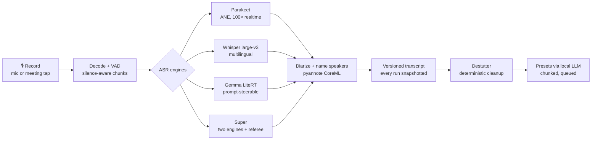
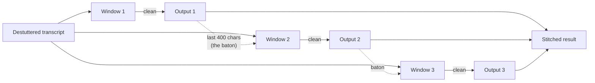
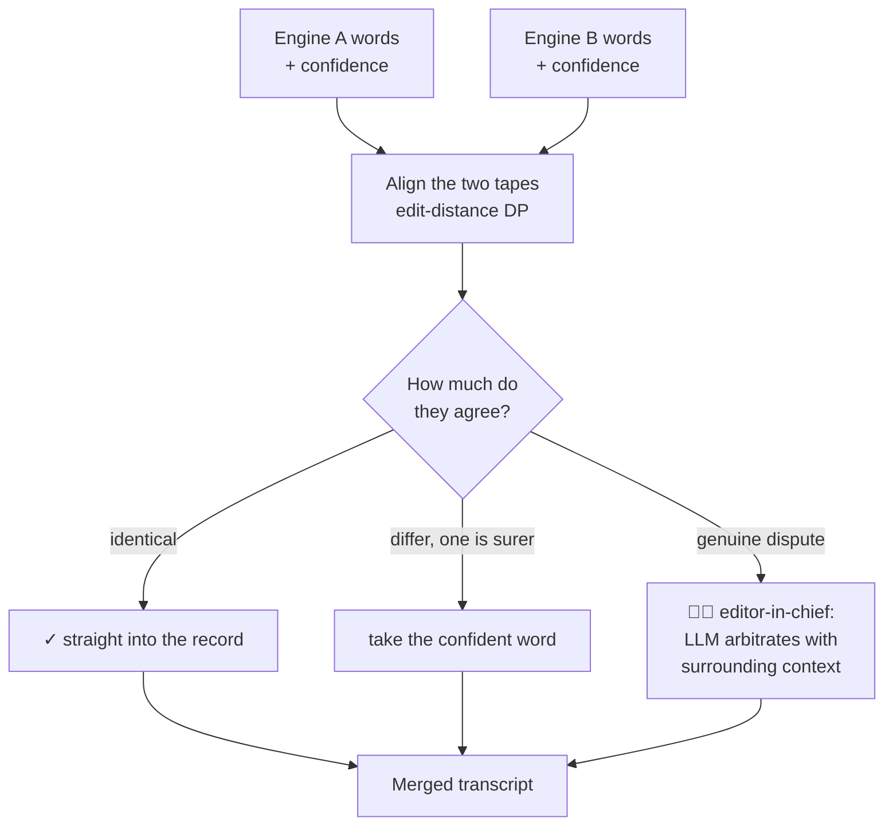
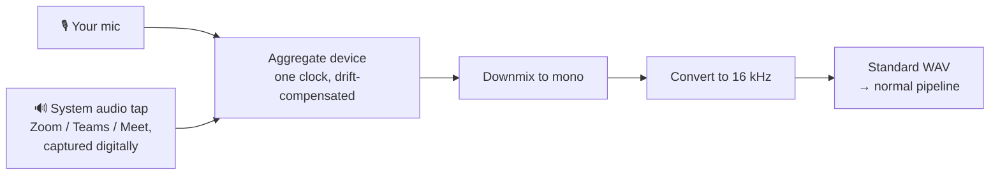

# What I Learned Building a Fully Local Transcriber for macOS

*Transcriberr is a native macOS app that records, transcribes, diarizes, and rewrites conversations — entirely on-device. No audio ever leaves the Mac. Getting there was harder than it looks, and the hard parts were never where I expected.*

## The shape of the machine

Before the war stories, the map. Every recording flows through one pipeline, and every hard-won lesson below lives at one of these stations:

## Hardship #1: The model that lied convincingly

The first architecture used one multimodal model (Gemma, via MLX) for everything: audio in, text out. It demoed beautifully — and then transcribed a business meeting as a conversation about music production that never happened. Whole paragraphs, fluent and confident, invented from noise.

The debugging lesson: **isolate the layer before blaming it.** A model that hallucinates looks identical to a broken microphone pipeline from the transcript view. We proved the recorder was healthy with a headless CLI (151 dB SNR on a test tone), proved the decode was healthy, and only then could we say with confidence: the 8-bit quantized audio tower itself was degraded. The same model family, running through Google's own LiteRT-LM runtime — the stack we'd already proven on Android — was word-perfect. Same weights, different runtime, opposite result. *You are not integrating a model; you are integrating a model-runtime pair.*

## Hardship #2: A small model cannot copy

Local post-processing (clean-up, rewrite, translation) runs on a small on-device LLM. The prompts said, clearly: *remove stutters, keep every sentence, copy speaker labels exactly.* The model agreed — for about two thousand characters. Then "Yuri:" became "uri:", stutters sailed through untouched, and by the end of a 27-minute transcript entire phrases were dropping: "Have weekend. Have great. Bye."

No prompt fixes this, because it isn't a comprehension failure — it's attention arithmetic. Think of a monk hand-copying a manuscript: the first page is immaculate, but ask for forty pages in one sitting and the hand drifts, letters fall off names, whole clauses vanish. You don't fix that monk with sterner instructions. You give him **one page at a time** — and you let a machine do the ruler-and-eraser work first. The fix was architectural, in three moves:

1. **Do mechanical work in code, not in the model.** A deterministic destutter pass collapses "for for for for", phrase echoes, and filler sounds *before* the model sees the text — measured on real recordings: 371 fillers → 0, 29 stutter-triples → 0. Code is free, instant, and doesn't drift. It's the sieve before the chef: the model should only ever receive ingredients worth judging.
2. **Never ask a small model for a long output.** Rewrites run per speaker-turn window (~2,600 chars) and are stitched back together.
3. **Pass the baton, not just the race.** Each window's prompt includes the tail of the *already-processed* previous window — like a relay runner who takes the baton at full stride because she watched the last twenty meters of the runner before her. Names, spellings, and sentence flow stay continuous across the seams:

A failed window falls back to its source text — content can never be lost, only left unpolished. And because the local engine is one kitchen with one chef, generations are queued FIFO: orders wait on the rail instead of two cooks fighting over the same stove (we watched that fight once — it produced an empty plate).

The general form of this learning: **prompt for judgment, code for mechanics, and chunk everything.**

## Hardship #3: The platform fights back quietly

Four macOS incidents, none of which threw a useful error at the time of the mistake:

- **~/Library/Caches is not storage.** macOS silently purged a 10 GB model mid-week. Models now live in Application Support.
- **SwiftData contexts don't share news.** Writes on one ModelContext were invisible to reads on another — deletes that didn't delete, restores that didn't restore, all silently. Like branch offices each keeping their own notebook: every office is internally consistent and the company books are wrong. The cure was structural: one main-actor context — a single ledger — which converted a whole class of "silent no-op" bugs into a compile-time discipline.
- **Code signatures must agree.** Google ships its LiteRT dylib signed with Google's Team ID. An ad-hoc-signed app embedding it launches fine from Xcode — and dies instantly as a packaged build, because dyld refuses to pair binaries from different teams. One `codesign --force -s -` per embedded dylib, scripted into packaging.
- **A recorder can be perfect and invisible.** The meeting recorder worked on day one — and its timer showed 00:00 forever, because the class wasn't observable and SwiftUI had no reason to re-render. Audio code earns trust only by producing a waveform.

## Architectural notes — the choices that paid off

### Engines are a protocol, quality is a tournament

Every ASR engine — Parakeet on the Neural Engine, Whisper large-v3, Gemma — implements one small protocol (`transcribeChunk`, `generateText`, capability flags). That made the killer feature almost free: *versioned transcripts.* Every run is snapshotted; engines compete on the same audio like sprinters on the same track, and the user reviews the photo finish. When we benchmarked against a Samsung S24's built-in transcriber, this is how we proved the app was better — per recording, side by side, not by vibes.

### Super mode, or: two stenographers and an editor-in-chief

"Super mode" runs two engines on the same audio and merges them with a ROVER-style alignment. The metaphor that explains it best: imagine **two court stenographers typing the same hearing**. Afterwards, an editor lays their two tapes side by side and slides them until the matching words line up — that's the dynamic-programming alignment. Then, word by word:

- Where both wrote the same thing, it goes straight into the record.
- Where they wrote different words, the editor checks **how sure each stenographer felt** at that moment (per-word confidence) and takes the surer one.
- Where the disagreement is genuine — both hesitant, or one heard "OWASP" and the other heard "a wasp" — the editor walks down the hall to the **editor-in-chief who has read the whole case file** (the local LLM, given the surrounding transcript as context) and lets him rule.

The subtle bug worth sharing: our first merge trusted agreement too early and threw away the one word only Whisper caught ("OWASP 10"). Verbatim shortcuts are only safe at near-certainty; everything else deserves a vote. An editor who rubber-stamps whenever the two tapes *look* similar will miss exactly the words that mattered.

### Meeting mode, or: plug into the soundboard

Recording a video call with a microphone pointed at your speakers is bootleg concert taping: echo, keyboard noise, your own voice twice. The right move is the sound engineer's: **plug into the soundboard.** macOS 14.4+ lets an app tap the audio other apps are playing — digitally, before it ever reaches the speakers. Transcriberr pairs that tap with the microphone in one aggregate device so both share a single clock (two metronomes, one conductor — no drift), downmixes, and feeds the exact same 16 kHz pipeline as any recording:

Because the same pipeline consumes it, meetings get transcription, diarization, versions, and presets for free — the capture layer is new, everything downstream is untouched.

### A CLI harness that runs the app's real code

Every pipeline stage — record, decode, transcribe, diarize — is executable headlessly, using the same classes as the GUI. Nearly every hard bug in this project was isolated by that harness, not by clicking through the app. If a pipeline can only be tested through its UI, it can't be debugged at all.

### Vocabulary as data, harvested from life

Names and product terms ("Blits", "Kaiko", "KimKim") are the difference between a transcript you trust and one you re-check. The app keeps per-language vocabulary lists — injected into ASR prompts and every rewrite — and they were bootstrapped automatically from the user's own files and past transcripts. The user's folder names are a better source of truth than any model's guess.

### Adversarial review before every release

Twice before shipping, an independent review pass hunted the newest code with explicit instructions to *break* it — and twice it found real bugs the happy path never would have shown: a double-press race that saved duplicate recordings, a frozen meeting timer, a queue that one wedged generation could block forever, a cleanup pass that quietly deleted sentence boundaries. The pattern generalizes: **the code you wrote today deserves a hostile reader today**, while the design is still soft.

## The one-line summary

Local-first AI is not "cloud AI, but smaller." It's a different engineering discipline: **prove each layer with evidence, let deterministic code do everything it can, give models only the short, judgment-shaped work they're actually good at — and never trust a demo.**

---

*Transcriberr runs Parakeet, Whisper, and Gemma fully on-device on Apple Silicon.*
*Yuri Ihnatov — [ihnatov.nl](https://ihnatov.nl) · [github.com/Ihnatov-yuri](https://github.com/Ihnatov-yuri)*
