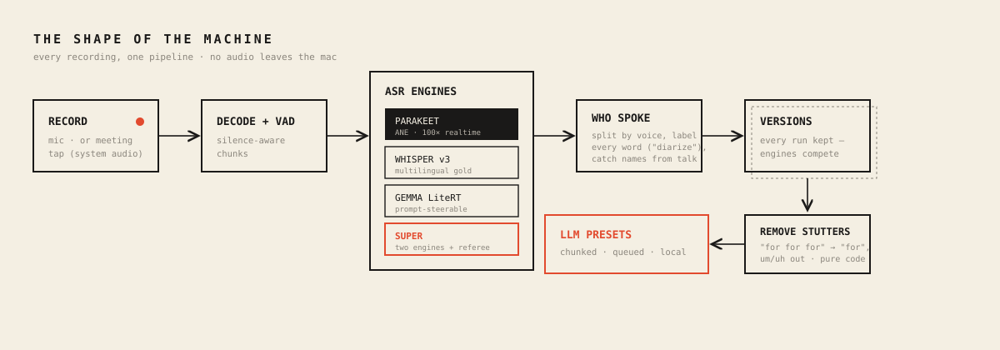
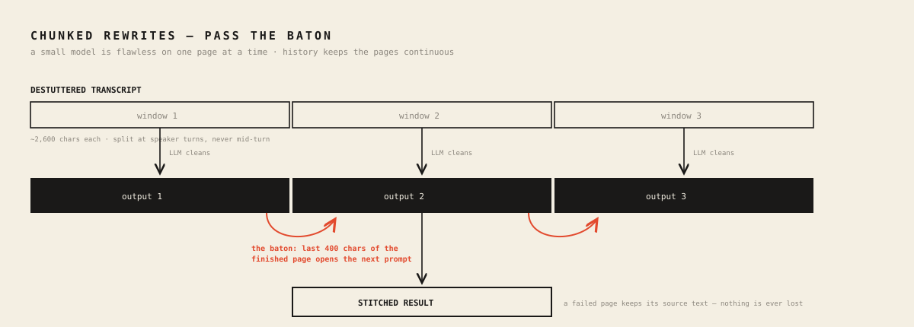
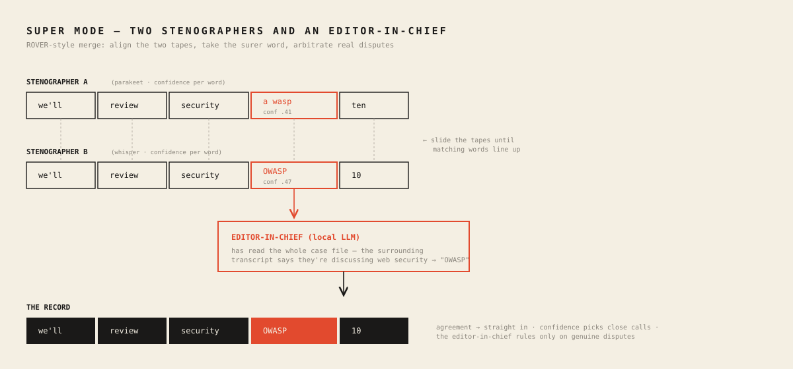
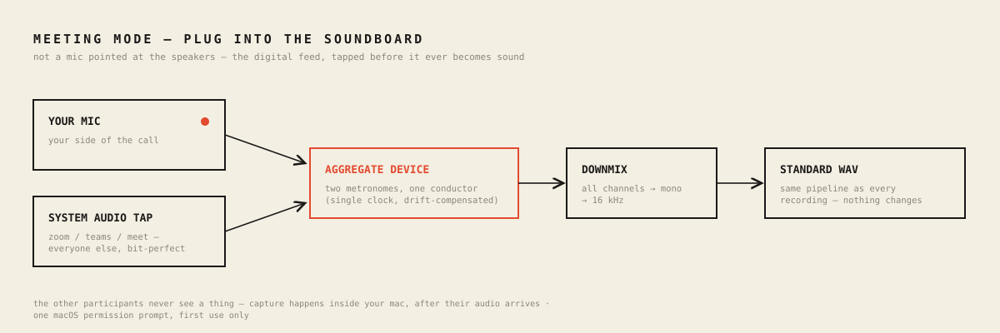

# What I Learned Building a Fully Local Transcriber for macOS

*Transcriberr is a native macOS app: record, transcribe, diarize, rewrite — all on-device. No audio leaves the Mac. Building it was hard in places I didn't expect. Here's what broke, and what held.*

## The shape of the machine

The map first. One pipeline, every recording. Every lesson below lives at one of these stations:

## Hardship #1: The model that lied convincingly

The first build used one multimodal model for everything: Gemma via MLX, audio in, text out. The demo looked great. Then it transcribed a business meeting as a conversation about music production. That conversation never happened. Fluent, confident, invented.

The rule that saved us: **isolate the layer before you blame it.** From the transcript view, a hallucinating model and a broken mic pipeline look identical. So prove layers one at a time. Headless CLI, test tone: 151 dB SNR — recorder healthy. Decode healthy. Which leaves the model — and there it was: the 8-bit quantized audio tower was degraded. Same Gemma through Google's LiteRT-LM runtime, the stack already proven on Android: word-perfect. Same weights, different runtime, opposite result.

You don't integrate a model. You integrate a model-runtime pair.

## Hardship #2: A small model cannot copy

Post-processing — cleanup, rewrite, translation — runs on a small on-device LLM. The prompt said: remove stutters, keep every sentence, copy speaker labels exactly. The model obeyed for about two thousand characters. Then "Yuri:" became "uri:", stutters passed straight through, and by minute 27 whole phrases were falling out: "Have weekend. Have great. Bye."

No prompt fixes this, because it isn't comprehension — it's attention arithmetic. Picture a monk copying a manuscript. Page one is immaculate. Page forty, letters fall off names and clauses vanish. Sterner instructions don't help the monk. One page at a time does. So, three moves:

1. **Mechanics in code, not in the model.** A deterministic pass collapses "for for for for", phrase echoes, and fillers before the model sees text. Measured on real recordings: 371 fillers → 0. 29 triple-stutters → 0. Code doesn't drift and costs nothing. The sieve before the chef.
2. **Short outputs only.** Rewrites run per speaker-turn window, ~2,600 characters, then stitch.
3. **Pass the baton.** Each window's prompt opens with the tail of the previous *processed* window. A relay runner takes the baton at full stride because she watched the last twenty meters. Names, spellings, and sentence flow survive the seams.

A failed window keeps its source text — content can't be lost, only left unpolished. And the local engine is one chef in one kitchen, so generations queue FIFO. We let two cooks share the stove once. The plate came back empty.

The rule: prompt for judgment, code for mechanics, chunk everything.

## Hardship #3: The platform fights back quietly

Four macOS incidents. Zero useful errors at the moment of the mistake.

- **~/Library/Caches is not storage.** macOS purged a 10 GB model mid-week, silently. Models live in Application Support now.
- **SwiftData contexts don't share news.** Writes on one ModelContext are invisible to reads on another. Deletes that didn't delete. Restores that didn't restore. Branch offices with separate notebooks: each internally consistent, company books wrong. The fix was structural — one main-actor context, a single ledger. A whole bug class became a compile-time rule.
- **Signatures must agree.** Google ships its LiteRT dylib signed with Google's Team ID. Ad-hoc app + Google-signed dylib runs fine from Xcode — and dies at launch as a packaged build, because dyld refuses to pair binaries from different teams. One `codesign --force -s -` per dylib, scripted into packaging.
- **A recorder can be perfect and invisible.** Meeting capture worked on day one. Its timer showed 00:00 forever — the class wasn't observable, so SwiftUI never re-rendered. Audio code earns trust by drawing a waveform.

## Architectural notes — what paid off

### Engines are a protocol, quality is a tournament

Every engine — Parakeet on the Neural Engine, Whisper large-v3, Gemma — implements one small protocol: `transcribeChunk`, `generateText`, capability flags. That's why versioned transcripts cost almost nothing to build: every run is snapshotted, engines race on the same audio, you review the photo finish. It's also how we settled "is it better than a Samsung S24?" — side by side, per recording, not by vibes.

The scoreboard, concretely: two real recordings, 28 and 42 minutes, same audio to both devices. Seven domain terms tracked — a company, a product, two cities, a security standard, a cloud platform, a meeting type. Transcriberr in Super mode: **7/7 exact**. Samsung: **2/7** — a European city came back as a country at war, a container platform became a word that doesn't exist, a company name turned into a cleaning product, and a "dev call" became "deaf calls". Where Samsung won: turn grouping — 39 clean speaker turns against our 115 fragments on the long file. That gap became a setting (speaker-turn gap, default 30 s), not a redesign.

### Super mode: two stenographers and an editor-in-chief

Super mode = two engines + a merge (ROVER-style). Two court stenographers type the same hearing. An editor lays the tapes side by side and slides them until the words line up — that's the alignment. Then, per word:

- Same word → straight into the record.
- Different words → the surer stenographer wins. Per-word confidence decides.
- Real dispute — one heard "OWASP", the other "a wasp" — goes to the editor-in-chief who has read the whole case file: the local LLM, given the surrounding transcript. He rules.

The bug that taught us the design: our first merge rubber-stamped anything that *looked* similar — and threw away the one word only Whisper caught, "OWASP 10". So: verbatim shortcuts only at near-certainty. Everything else gets a vote.

### Meeting mode: plug into the soundboard

Recording a call with a mic pointed at the speakers is bootleg concert taping. The engineer's move: plug into the soundboard. macOS 14.4+ lets an app tap what other apps play — digitally, before it ever becomes sound. That tap plus the mic go into one aggregate device: single clock, drift-compensated. Two metronomes, one conductor. Downmix, 16 kHz, same WAV as every recording.

Which means meetings inherit transcription, diarization, versions, and presets for free. New capture layer, untouched pipeline.

### A CLI harness that runs the app's real code

Every stage — record, decode, transcribe, diarize — runs headlessly through the same classes the GUI uses. Nearly every hard bug fell to the CLI, not to clicking around. If a pipeline is only testable through its UI, it isn't debuggable.

### Vocabulary as data, harvested from life

Names decide whether you trust a transcript. The app keeps per-language vocabulary lists — injected into ASR prompts and every rewrite — bootstrapped from my own files and past transcripts. My folder names beat any model's guess.

### Adversarial review before every release

Twice before shipping, an independent review pass attacked the newest code with orders to break it. Twice it found real bugs the happy path hides: a double-press race saving duplicate recordings, a frozen meeting timer, a queue that one wedged generation could block forever, a cleanup pass quietly deleting sentence boundaries. Today's code deserves a hostile reader today — while the design is still soft.

## The one-line summary

Local-first AI is not cloud AI, smaller. It's a different discipline: prove each layer with evidence, let deterministic code do everything it can, give the model only short, judgment-shaped work — and never trust a demo.

---

*Transcriberr runs Parakeet, Whisper, and Gemma fully on-device on Apple Silicon.*
*Yuri Ihnatov — [ihnatov.nl](https://ihnatov.nl) · [github.com/Ihnatov-yuri](https://github.com/Ihnatov-yuri)*
