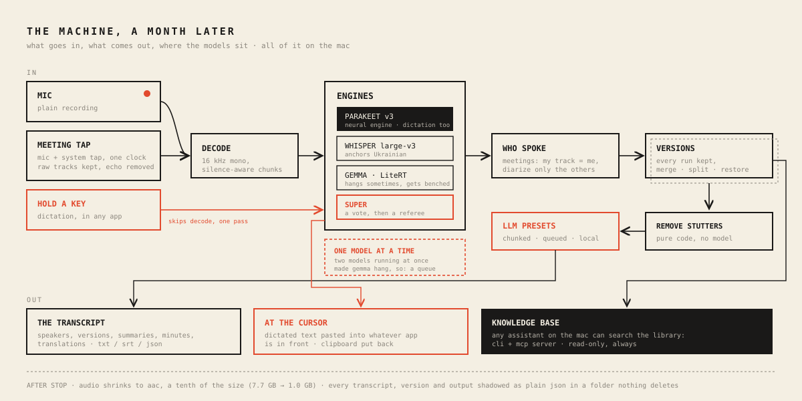
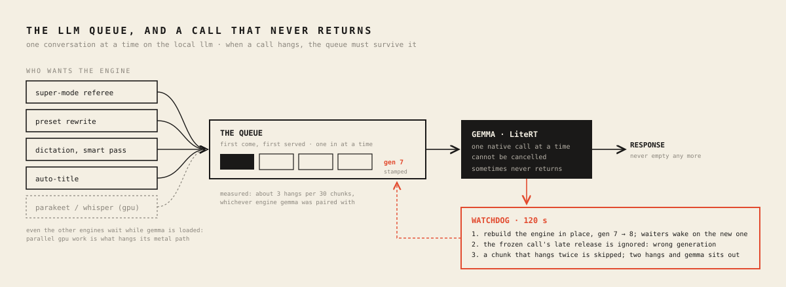
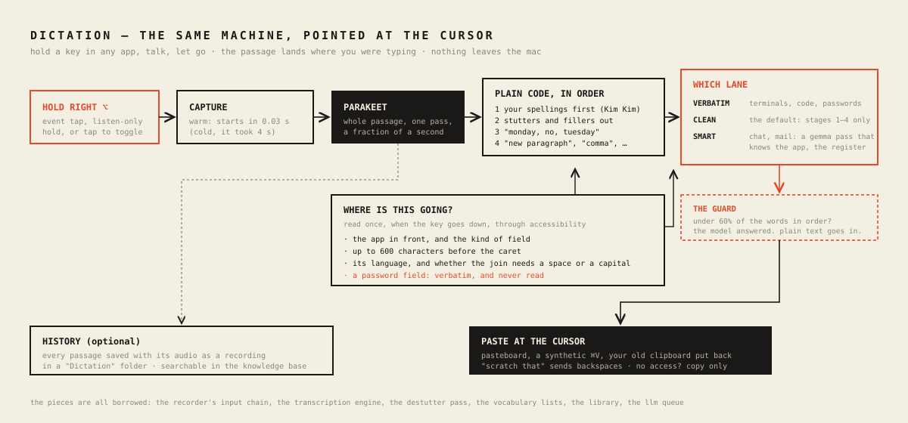

# What I Learned Building a Fully Local Transcriber for macOS

*Transcriberr is a native macOS app: record, transcribe, diarize, rewrite — all on-device. No audio leaves the Mac. Building it was hard in places I didn't expect. Here's what broke, and what held.*

## The shape of the machine

The map first. One pipeline, every recording. Every lesson below lives at one of these stations:

## Hardship #1: The model that lied convincingly

The first build used one multimodal model for everything: Gemma via MLX, audio in, text out. The demo looked great. Then it transcribed a business meeting as a conversation about music production. That conversation never happened. Fluent, confident, invented.

The rule that saved us: **isolate the layer before you blame it.** From the transcript view, a hallucinating model and a broken mic pipeline look identical. So prove layers one at a time. Headless CLI, test tone: 151 dB SNR — recorder healthy. Decode healthy. Which leaves the model — and there it was: the 8-bit quantized audio tower was degraded. Same Gemma through Google's LiteRT-LM runtime, the stack already proven on Android: word-perfect. Same weights, different runtime, opposite result.

You don't integrate a model. You integrate a model-runtime pair.

## Hardship #2: A small model cannot copy

Post-processing — cleanup, rewrite, translation — runs on a small on-device LLM. The prompt said: remove stutters, keep every sentence, copy speaker labels exactly. The model obeyed for about two thousand characters. Then "Yuri:" became "uri:", stutters passed straight through, and by minute 27 whole phrases were falling out: "Have weekend. Have great. Bye."

No prompt fixes this, because it isn't comprehension — it's attention arithmetic. Picture a monk copying a manuscript. Page one is immaculate. Page forty, letters fall off names and clauses vanish. Sterner instructions don't help the monk. One page at a time does. So, three moves:

1. **Mechanics in code, not in the model.** A deterministic pass collapses "for for for for", phrase echoes, and fillers before the model sees text. Measured on real recordings: 371 fillers → 0. 29 triple-stutters → 0. Code doesn't drift and costs nothing. The sieve before the chef.
2. **Short outputs only.** Rewrites run per speaker-turn window, ~2,600 characters, then stitch.
3. **Pass the baton.** Each window's prompt opens with the tail of the previous *processed* window. A relay runner takes the baton at full stride because she watched the last twenty meters. Names, spellings, and sentence flow survive the seams.

A failed window keeps its source text — content can't be lost, only left unpolished. And the local engine is one chef in one kitchen, so generations queue FIFO. We let two cooks share the stove once. The plate came back empty.

The rule: prompt for judgment, code for mechanics, chunk everything.

## Hardship #3: The platform fights back quietly

Four macOS incidents. Zero useful errors at the moment of the mistake.

- **~/Library/Caches is not storage.** macOS purged a 10 GB model mid-week, silently. Models live in Application Support now.
- **SwiftData contexts don't share news.** Writes on one ModelContext are invisible to reads on another. Deletes that didn't delete. Restores that didn't restore. Branch offices with separate notebooks: each internally consistent, company books wrong. The fix was structural — one main-actor context, a single ledger. A whole bug class became a compile-time rule.
- **Signatures must agree.** Google ships its LiteRT dylib signed with Google's Team ID. Ad-hoc app + Google-signed dylib runs fine from Xcode — and dies at launch as a packaged build, because dyld refuses to pair binaries from different teams. One `codesign --force -s -` per dylib, scripted into packaging.
- **A recorder can be perfect and invisible.** Meeting capture worked on day one. Its timer showed 00:00 forever — the class wasn't observable, so SwiftUI never re-rendered. Audio code earns trust by drawing a waveform.

## Architectural notes — what paid off

### Engines are a protocol, quality is a tournament

Every engine — Parakeet on the Neural Engine, Whisper large-v3, Gemma — implements one small protocol: `transcribeChunk`, `generateText`, capability flags. That's why versioned transcripts cost almost nothing to build: every run is snapshotted, engines race on the same audio, you review the photo finish. It's also how we settled "is it better than a Samsung S24?" — side by side, per recording, not by vibes.

The scoreboard, concretely: two real recordings, 28 and 42 minutes, same audio to both devices. Seven domain terms tracked — a company, a product, two cities, a security standard, a cloud platform, a meeting type. Transcriberr in Super mode: **7/7 exact**. Samsung: **2/7** — a European city came back as a country at war, a container platform became a word that doesn't exist, a company name turned into a cleaning product, and a "dev call" became "deaf calls". Where Samsung won: turn grouping — 39 clean speaker turns against our 115 fragments on the long file. That gap became a setting (speaker-turn gap, default 30 s), not a redesign.

### Super mode: two stenographers and an editor-in-chief

Super mode = two engines + a merge (ROVER-style). Two court stenographers type the same hearing. An editor lays the tapes side by side and slides them until the words line up — that's the alignment. Then, per word:

- Same word → straight into the record.
- Different words → the surer stenographer wins. Per-word confidence decides.
- Real dispute — one heard "OWASP", the other "a wasp" — goes to the editor-in-chief who has read the whole case file: the local LLM, given the surrounding transcript. He rules.

The bug that taught us the design: our first merge rubber-stamped anything that *looked* similar — and threw away the one word only Whisper caught, "OWASP 10". So: verbatim shortcuts only at near-certainty. Everything else gets a vote.

### Meeting mode: plug into the soundboard

Recording a call with a mic pointed at the speakers is bootleg concert taping. The engineer's move: plug into the soundboard. macOS 14.4+ lets an app tap what other apps play — digitally, before it ever becomes sound. That tap plus the mic go into one aggregate device: single clock, drift-compensated. Two metronomes, one conductor. Downmix, 16 kHz, same WAV as every recording.

Which means meetings inherit transcription, diarization, versions, and presets for free. New capture layer, untouched pipeline.

### A CLI harness that runs the app's real code

Every stage — record, decode, transcribe, diarize — runs headlessly through the same classes the GUI uses. Nearly every hard bug fell to the CLI, not to clicking around. If a pipeline is only testable through its UI, it isn't debuggable.

### Vocabulary as data, harvested from life

Names decide whether you trust a transcript. The app keeps per-language vocabulary lists — injected into ASR prompts and every rewrite — bootstrapped from my own files and past transcripts. My folder names beat any model's guess.

### Adversarial review before every release

Twice before shipping, an independent review pass attacked the newest code with orders to break it. Twice it found real bugs the happy path hides: a double-press race saving duplicate recordings, a frozen meeting timer, a queue that one wedged generation could block forever, a cleanup pass quietly deleting sentence boundaries. Today's code deserves a hostile reader today — while the design is still soft.

## The one-line summary

Local-first AI is not cloud AI, smaller. It's a different discipline: prove each layer with evidence, let deterministic code do everything it can, give the model only short, judgment-shaped work — and never trust a demo.

## Part two: a month later

The first part of this went up on 6 August, when the app was at version 1.2. It is now 5 September, the app is at 3.2, and fifty releases sit between the two. Most of the month went on things the August map barely had room for: meetings that record cleanly, a language model that sometimes stops answering, and dictation into any app on the Mac. The rest went on plumbing, which only shows up in a piece like this when it fails, so it will.

### The map, redrawn

The middle of the map is the same. The edges have changed. Audio now arrives three ways: from the microphone, from the meeting tap, or from a key you hold down while you talk. The first two feed the pipeline. The key skips it: the passage goes straight to Parakeet and straight back out, with no decoder, no chunking and no diarization in between. Text leaves three ways: as the transcript, as words pasted at the cursor of whichever app is in front, and through a read-only interface that lets any assistant running on the machine search the library. Under the engines sits a queue. Running Gemma at the same time as another model made Gemma hang, so the app now runs one model at a time. Along the bottom, every finished recording shrinks to a tenth of its size, and every transcript is shadowed to a folder of plain JSON that nothing in the app will ever delete.

## Hardship #4: The chef who freezes

In August I wrote that the local language model is one chef in one kitchen, and that letting two cooks share the stove had produced an empty plate. That was the right picture and I had drawn half of it. The empty plates kept coming on days when, as far as I could tell, nobody was sharing anything, until the log gave it away: every zero-character response coincided with a Super-mode merge running at the same moment. Swift actors are reentrant at every await. An arbitration and a preset rewrite had each entered the actor, each awaited the engine, and the runtime had interleaved two conversations on one LiteRT session. One of them starved. The fix was a lock that hands out the engine first come, first served, and holds the door until the caller is done.

Which is when the chef froze. LiteRT's native call sometimes hangs, and it cannot be cancelled. The task holding the lock never reaches its cleanup, the lock stays held, and every later caller queues behind a corpse. I found this the way one finds these things, by waiting a long time for a summary that was never coming. The lock now carries a generation number. When the watchdog rebuilds the engine, the generation ticks over, the waiters wake up against the fresh engine, and whenever the frozen call finally lets go, its release belongs to a generation that is gone, so nothing happens. Around that sits a ladder. After 120 seconds the engine is rebuilt in place. A chunk that hangs twice is skipped. After two hangs in one run, Gemma is benched and the other engine finishes on its own. In a sweep of all six engine pairings on the same Ukrainian meeting, Gemma hung about three times in thirty chunks whichever partner it had, so the ladder gets climbed on ordinary Tuesdays.

One more thing sat underneath all of it. GPU work from another engine at the same moment was enough on its own to wedge LiteRT's Metal path. So there is now a gate across every engine: while a Gemma engine is loaded, heavy inference of any kind goes through one queue, and when no Gemma is loaded the gate lets everything straight through. The stove is fine. It has one burner.

The error that cost me two releases: the log said "error 3". I opened the enum, counted down to the third case, and spent two versions chasing an engine that was never unavailable. Foundation does not number the cases of a payload-less Swift enum in the order they are declared. Error 3 was the chunk timeout all along.

## Hardship #5: Measured first, then redesigned

Super mode on a real 52-minute meeting, with the referee reading both sides of every chunk in sequence, took 24 minutes and 59 seconds. Then I looked at what the referee had actually done. The two engines agreed on 221 of the 226 chunks and never needed him. Running everything in sequence had bought context for five decisions and charged twenty minutes for it. The redesign runs the first pass three chunks wide with a plain vote and no Gemma at all, then sends only the disputed chunks, where agreement is below 0.8, back for a second, sequential pass in which the referee sees the transcript on both sides plus the vocabulary list. Two engines from different families dispute about 70% of the chunks on Ukrainian, so the second pass takes the ten worst disputes and lets the vote stand for the rest.

The vote itself had a flaw that only a second language shows. Parakeet's confidence is calibrated on English, and on Ukrainian it stayed confident on precisely the words Whisper had right, so "NBE" lost to a Cyrillic misreading. Each engine now carries a prior per language: Parakeet v3 counts for half on Ukrainian, Parakeet v2 for half on anything that is not English, and Whisper anchors Ukrainian. A Whisper-plus-Gemma pairing stays a good one for Ukrainian because, when Gemma misbehaves, the ladder above degrades the run to almost pure Whisper, which is where you want to end up anyway. Two smaller things fell out of the same recording. Parakeet's tokens carry a literal leading space, which had doubled every separator in merged text. And Whisper splits Ukrainian words at the apostrophe, so "Пам" and "'ятаєш" arrive as two tokens and have to be glued back before anyone votes on them.

## Hardship #6: The meeting that muted everyone but me

Meeting mode had more releases than anything else, and the bug I am least proud of. The recorder told the microphone and the system tap apart by their position in the aggregate device's buffer list: buffer zero was the mic, everything after it was the tap. Nobody had promised that order. The echo gate downstream mutes the mic whenever the far side is louder, so on a machine where the order came out the other way round, the gate muted the other participants at exactly the moments I was speaking. The live waveform went flat for everyone but me, and the saved mix followed it. The tap is built as a stereo mixdown by construction, so the buffers are now told apart by channel count, and position is consulted only when the counts happen to match.

The echo took longer. The tap is digital, but the mic hears the room, so the far side arrives twice, once cleanly and once through my speakers. First there was a duck, then a full gate on the mic while the far side speaks, then an offline echo canceller, NLMS, run against the raw mic and system tracks after the recording stops, so that the saved mix is rebuilt from a clean signal, where before it was a gated one. Measured on a real call: 11.8 dB off the echo, 0.2 dB off my own speech. What the canceller misses at the seams, a scrub at sentence level catches, with fuzzy matching, because echo degrades "schedule" into "scheduled" on its way through the room. Two structural moves made the rest easier. The raw tracks are kept beside the mix and transcribed separately, so my track is ground truth for "me" and the diarizer only has to untangle the others. And the speaker count became a maximum. Forcing an exact count had been manufacturing phantom speakers whenever fewer people talked.

And then live captions. The recorder's caption stream was created once, in the initialiser, and finished by stop. An AsyncStream cannot be un-finished. Live captions therefore worked for the first recording of each session and died for every one after. I fixed that in the plain recorder on 24 August and found the identical bug in the meeting recorder on 4 September. Meeting mode is the default. In practice, live captions had never worked.

## Hardship #7: Files

Recordings took 7.7 GB. They take 1.0 GB now. Recording still writes WAV, because encoder work inside a CoreAudio callback is a risk I did not want to take with live capture. Once a file is closed and its database row is saved, it is transcoded to 16 kHz mono AAC at 48 kbps, checked against the original's duration, and only then is the WAV deleted. The first draft did that the other way round, transcoding before the row was saved, which meant a crash mid-transcode would have left a complete recording on disk with no row pointing at it, invisible forever. The order of operations is the whole feature.

Splitting a recording in two, which arrived later, came with a sound I had to hear to believe: robotic, with small clicks at the cut. The split decoded the compressed source and re-encoded both halves, a second lossy pass on top of the first, and at the cut point that measures about 6% RMS distortion against the source, where an ordinary re-encode measures under 1%. The bitrate could not go up: 48 kbps is the top of AVAudioConverter's list for 16 kHz mono. So the split now trims the original bitstream without touching the encoder, which measured 0%, and both the cut and the join get a 20 ms fade, which any audio tool does at a boundary and this one had been missing everywhere it joined raw samples.

Every transcript, every version of it, and every generated output now also lives as human-readable JSON in a Backups folder next to the project, never pruned, including after a delete. A corrupted store takes nothing with it. And one bug I had blamed on SwiftData for a week was mine. Duplicate versions kept appearing with the same timestamp. The deduplication compared two transcripts by their encoded JSON strings, and JSONEncoder's key order is not stable between two encodes of the same value. A standalone harness put numbers on it: under heap churn, 131 of 150 identical saves produced a duplicate with the string comparison, and 0 of 300 with a comparison of the decoded content.

## Dictation: the same machine, pointed at the cursor

This is the part of the month I use every day. Hold the right Option key in any app, talk, let go, and the passage appears where the cursor was. Under the hood it is the app's existing parts in a different order. The recorder's input chain captures into memory. Parakeet decodes the whole passage in one pass on the Neural Engine, a fraction of a second for half a minute of speech. While you are still talking, the buffer so far is decoded every 2.5 seconds and shown as provisional text, and the final pass runs over the whole passage, so the preview's mistakes never reach the cursor. Then come the same deterministic stages the presets use, in an order that took one bug to settle: vocabulary spellings first, then the destutter pass, then self-corrections, then spoken commands. The order matters because one of the names on my vocabulary list is KimKim, and the destutter pass, run first, made it Kim.

Wispr Flow does the clever part of this in the cloud, and I wanted it on the Mac. When the key goes down, the app reads through Accessibility which app is in front, what kind of field has focus, and up to 600 characters before the caret. Password fields are never read. A per-app rule then picks a lane. Terminals and code editors get the words verbatim. Slack and WhatsApp get a Gemma pass told to write casually, Mail and Outlook get one told to write formally, Notes and Word get one with no particular register, and everything else gets the deterministic text and nothing more. The text before the caret settles the language when recognition is on auto, and whether the join needs a space or a capital letter.

The Gemma pass needed a guard, because a small model handed "what time is the meeting tomorrow" will sometimes answer the question. The polished text is accepted only if at least three quarters of its words appear, in order, in the raw passage, and only if the passage's tail survives, because in one end-to-end run Gemma dropped the last sentence and kept a straight face. Otherwise the deterministic text goes in and the model's opinion goes nowhere. "Monday, no, Tuesday" becomes Tuesday in code, with an idiom guard so that "no, no, no" survives. "Scratch that" sends backspaces to the app in front, in English, Dutch, German and Ukrainian.

The vocabulary list from part one now writes itself. At launch the app reads the library's transcripts and keeps any capitalised term that turns up mid-sentence in more than one recording, is three words or fewer, and is not an ordinary word the recognizer happened to capitalise: 126 names from 46 transcripts, in 0.3 seconds. Those spellings feed dictation straight away, Settings offers them for promotion into the permanent list, and every new passage offers its unknown names as one-tap additions. The folder names beat the model's guess in August. The meetings beat the folder names now.

Three things bit on the way.

The first was silence at the start of every passage. Enabling voice processing on a cold audio engine took four seconds, measured, and four seconds after the key goes down is when the first sentence is already over. The input chain is now warmed at launch and again after every stop. Start takes 0.03 seconds.

The second was a grant that vanished with every release. macOS keys its permission grants to the app's designated requirement, and an ad-hoc signature sets that to a hash of the build. So after every update, System Settings showed Transcriberr ticked under Accessibility while the process was untrusted and the hotkey never armed. The packaging script now signs with an explicit requirement keyed to the bundle identifier, which every build satisfies. Remove and re-add the app in that list once, and the grant stays.

The third was the hotkey itself. It began as an NSEvent global monitor and ended as a listen-only CGEvent tap, the channel Karabiner-style tools use, which re-arms itself if macOS disables it and reports every key event it sees so the Dictate screen can show the last one. A deaf hotkey with no diagnostics is a support ticket with no answer.

I tested the whole path without touching the keyboard: a URL scheme starts a session, the system's own text-to-speech voice reads a sentence through the speakers, another URL stops it, and the knowledge base is searched for the sentence. The first run found nothing, because the echo canceller was doing its job on the speaker output. That is the kind of failure I will take.

## The library, opened up

Folders and tags arrived in August, and behind them a door: a command-line interface and a small MCP server that expose the library to any assistant on the machine. The store is opened read-only, with a fresh context for each request, and the write-ahead log makes concurrent reads safe while the app is running. Nothing on that path can save or migrate. It is how I verified dictation, and how a coding assistant now reads my meeting notes without a byte of them leaving the machine.

## Hostile readers, on a schedule

In August there were sixteen tests. There are 123 now, and no release ships without them passing. The adversarial review from part one became routine, with numbers: ten confirmed issues on the compression change, fifteen on split, nine in a general sweep. Two of the platform's habits belong on the record. A test host launched by launchd from a folder under Documents blocks in the dynamic loader on the "access your Documents folder" prompt, which nobody is there to answer, and looks exactly like a hang. And two Swift packages that each ship an XCFramework with a file called module.modulemap collide in a fresh checkout, so both are pinned to versions that build.

## The second summary

A month in, the hard bugs have moved out of the models and into state I cannot see: a lock across an await, a grant keyed to a build hash, a stream that will not restart, a buffer order nobody promised. The evidence rule from part one still holds. It now applies to the platform.

---

*Transcriberr runs Parakeet, Whisper, and Gemma fully on-device on Apple Silicon.*
*Yuri Ihnatov — [ihnatov.nl](https://ihnatov.nl) · [github.com/Ihnatov-yuri](https://github.com/Ihnatov-yuri)*
