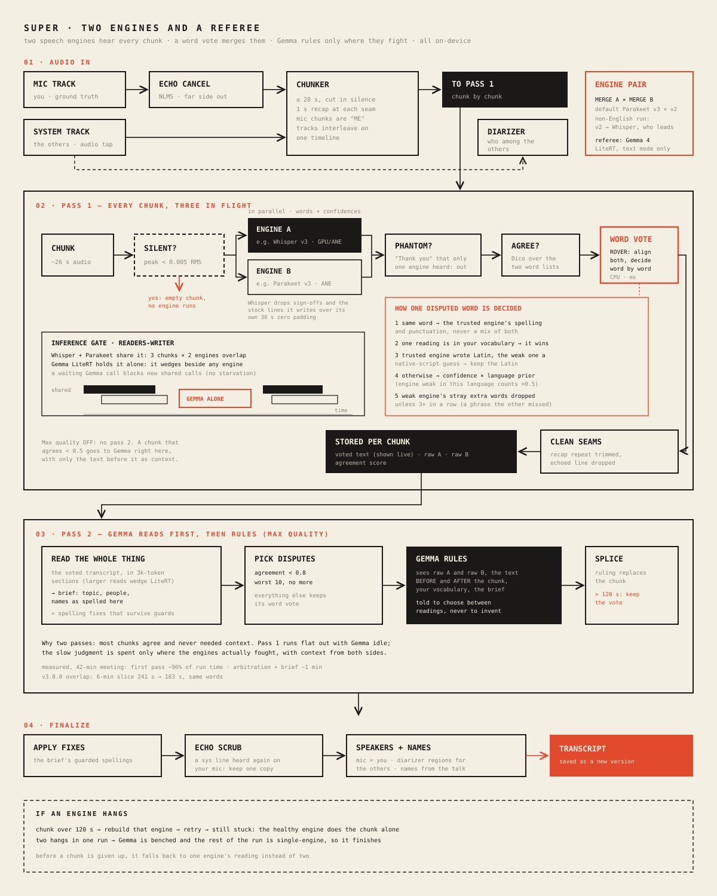

# How Super works

Super runs two speech engines over every chunk of audio, merges their readings word by word, and asks Gemma to rule only on the chunks where the two engines disagree. Everything runs on the Mac.

## 01 · Audio in

A meeting recording has two tracks. The **mic track** is you, so anything on it is labelled "ME" without guessing. It first goes through an NLMS echo canceller that subtracts the far side's voice leaking from your speakers. The **system track** is everyone else, captured by the audio tap. Only the system track goes to the diarizer, which works out who among the others is speaking.

The echo canceller is an NLMS filter (step 0.1) followed by a suppressor that mutes 20 ms frames the filter can fully explain as echo. Until v3.9.0 the step was 0.5: under heavy crosstalk the filter diverged (its output came out 7.3 dB louder than the raw mic on one Ukrainian meeting), the suppressor then worked from a garbage echo estimate, and it muted the user's own words: 54 of 404 lost on one 5-minute slice. At step 0.1 and a suppressor threshold of 1.5 (was 3), the same slices lose 8. The delay between the speaker and the mic is found by cross-correlation over the four loudest non-overlapping minutes of the far side, and the best one decides: on a real 32-minute call the loudest minute alone read 0.065 ("no echo path", nothing cancelled) while another held a 40 ms echo at 0.45. When the linear filter itself removes under 8 dB (median over the seconds the far side talks: 18.7-19.5 dB on three real calls, 4.0 dB on one Ukrainian meeting with no linear echo path), the suppressor would be deciding from noise, and the raw mic goes on instead; its echo is removed later, by timing (below). On that meeting this took WER from 19.9% to 16.7%.

The chunker cuts each track into chunks of at most 28 s, cutting in silence where it can. Each chunk after the first repeats the last second of the one before it (the "recap"), so a word spoken across a cut is never lost. The mic and system chunks share one timeline.

The **engine pair** comes from Detail → RUN → MERGE A / MERGE B. The default is Parakeet v3 with Parakeet v2. Parakeet v2 only knows English, so in a non-English run it is replaced by Whisper large-v3, which then leads the pair. The referee is the local text engine, Gemma 4 on LiteRT, used in text mode only (its audio mode is not trusted).

**The timeline (Max quality).** Before pass 1 the whole tracks are read once onto the shared clock. Whisper reads them in every language but English, and each chunk then takes the Whisper words timed inside it; Parakeet still runs per chunk, and in a split-track meeting also reads both whole tracks in a few seconds.

Why Whisper reads whole tracks: The reason is WhisperKit's window loop: on a 28 s chunk it decodes one 30 s window, then seeks to the last segment it finished and decodes the few seconds left as a second window padded with ~26 s of zeros. The words before every cut are read from a scrap with nothing after it (and the stock lines written over that padding are the phantoms timed at 39-56 s in old logs). Over a whole track the same loop always has real audio ahead. On the Ukrainian reference slices this took Super from 23.0% to 21.5% and from 19.7% to 15.5% WER; in English it cost 0.6-0.8 points, so English stays chunked.

**Language repair.** Whisper forced to Ukrainian translates English speech ("After four interviews they realized that" came out "чотири інтерв'ю вони зрозуміли") or spells it in Cyrillic. Where Whisper and Parakeet's whole-track reading fall apart on a segment (Dice under 0.4), Whisper's language detection is asked about that stretch (one encoder pass, so only there); an English verdict at 0.5 or more re-reads it in English and splices it in by time. On the Ukrainian slices it fired on exactly the three English sentences and nowhere else.

**Echo by timing.** Both tracks run on one clock and the speaker-to-mic delay is 30-50 ms, so an echoed word sits at the same moment as its original on the system track. A mic word is dropped when it is part of a run of at least three words that match the far side's words (both engines' whole-track readings) within 0.6 s, with at most one garbled word between matches. A single simultaneous "yes" survives, and so do the user's own repeats a second later. This catches echo the sentence-level scrub cannot: garbled copies ("measure the power of our iPhone 4" for "measure that ROI") and copies inside the same line as the user's words.

Code: `TranscriptionRunner.run`, `AudioDecoder.chunk`, `EnsembleBackend.resolvePair`, `EnsembleBackend.prepareTimeline`, `EnsembleBackend.repairLanguage`, `EnsembleBackend.echoFiltered`.

## 02 · Pass 1: every chunk, three in flight

Three chunks are in progress at any time. For each chunk:

1. **Silent?** If the loudest 200 ms of the chunk is below 0.005 RMS, neither engine runs and the chunk is empty. In a split-track meeting each track is silent while the other side talks, and Whisper used to spend about 2.3 s per silent chunk writing a phantom "you".
2. **Both engines, in parallel.** Each returns its text plus a confidence for every word. Whisper already drops subtitle sign-offs, and the stock lines it writes over the zero padding it adds to reach 30 s.
3. **Phantom check.** If one engine heard only a stock line ("Thank you", "Дякую") and the other heard silence, the line is dropped.
4. **Agreement.** A Dice score over the two word lists (1.0 means the same words).
5. **Word vote (ROVER).** The two word sequences are aligned, and every place they differ is decided by the rules in the diagram. The same word takes the trusted engine's spelling and punctuation. A word from your vocabulary wins. A Latin-script word from the trusted engine beats a native-script guess from the weak one. Otherwise the choice goes by confidence times a per-language prior (0.5 for an engine that is weak in this language). Stray extra words from the weak engine are dropped unless there are three or more in a row. With equal priors (English), a word only one engine heard is dropped when it repeats its neighbour or the phrase beside it ("I was I was"), or is one engine's split of the word the other wrote whole ("Kim Kim KimKim", "cheaper lm LLM", "R ROI"). Before that rule Super scored worse than Whisper alone in English (12.5% vs 10.6%, 8.1% vs 5.8% WER); after it, better (8.9%, 5.3%). The vote is pure CPU and takes milliseconds.

The runner then trims the recap repeat at the seam, drops a line that echoes the previous one, shows the voted text live, and stores the raw text from each engine plus the agreement score for pass 2.

**The inference gate.** LiteRT's Metal path hangs if another engine runs inference at the same moment. `InferenceGate` is a readers-writer lock: Whisper and Parakeet share it, so all six engine calls (three chunks, two engines) can overlap, while Gemma takes it exclusively and runs alone. A Gemma call that is waiting blocks new shared calls, so it can't be starved. Before v3.8.0 the gate was held whenever LiteRT was merely loaded, which made the whole first pass run one call at a time while Gemma sat idle.

Code: `EnsembleBackend.transcribeChunkRich`, `EnsembleBackend.roverMerge`, `WhisperBackend.transcribeDetailed`, `InferenceGate`.

## 03 · Pass 2: Gemma reads, and rules in English

This pass runs only when **Max quality** is on (Settings).

1. **Read the whole thing.** Gemma reads the voted transcript in sections of about 3,000 tokens and writes a brief: topic, people, and names as spelled in this recording. It may also propose spelling fixes, which are kept only if they pass the guards in `MeetingBrief.swift` (the replacement already appears in the transcript, the two words sound alike, and so on). Larger reads were measured to hang LiteRT.
2. **Rulings, English runs only by default** (Settings → "Gemma rules on disputed chunks": English / all / never). Chunks with agreement below 0.8, the worst 10, go to Gemma with both readings, the text around them, your vocabulary and the brief; its ruling replaces the chunk.

What was measured. Of 581 logged rulings, 52% were Whisper's text verbatim, 9% Parakeet's, 16% one of them with a character or two changed, 23% new text: a small model asked to rewrite a chunk mostly copies an input. On the reference set that helps a little in English (en-a 9.9 → 8.9% WER, and 13.1 → 12.1% on an older build; en-b unchanged) and not in Ukrainian (uk-a 16.5 vs 16.7%, uk-b 12.2% without rulings against 15.2% with). A redesign that asked Gemma only "A or B" per disputed stretch was tried and lost in both languages: on the 40 stretches where the reference shows the right reading, Gemma chose right 21 times, a coin flip, preferring Parakeet's Russian-leaning garble to Whisper's Ukrainian; the word vote chose right 26 times. The limit is the model, not the prompt.

Code: `TranscriptionRunner.run` (max-quality second pass), `MeetingBriefBuilder`, `EnsembleBackend.arbitrate`.

## 04 · Finalize

The brief's guarded spelling fixes are applied. Then the user's vocabulary: a name split by a space ("Kim Kim", "master card", "Web RTC") is joined into the vocabulary spelling, and a capitalized non-word within one sound of exactly one coined term ("Kinkim" → "KimKim") is respelled. The vote only consults the vocabulary where the engines disagree, so a name both wrote the same wrong way never reached it before; over the library this made 60 changes, all correct. The spell checker is asked about words as written, since it only knows proper nouns capitalized ("Indian", not "indian"). The echo scrub then finds lines from the system track that were heard again on your mic and keeps one copy. Speakers are assigned: mic lines are you, the diarizer's regions label the others, and names are picked up from the conversation. The result is saved as a new version of the transcript.

Code: `TranscriptionRunner.finalizeSegments`.

## If an engine hangs

Every chunk has a 120 s limit. After a timeout each engine checks whether one of its own calls has been running for too long (60 s for Whisper and Parakeet, 120 s for Gemma, whose healthy generations run longer); only that engine is rebuilt (the new one is built before the old one is let go, so the other chunks in flight keep running), its stuck hold on the inference gate is evicted, and the chunk is retried. If it hangs again, the healthy engine transcribes the chunk alone. After two hangs in one run, Gemma is benched and the rest of the run uses a single engine, so the run still finishes.

## Where the time goes

On a 42-minute split-track meeting (v3.7.0), pass 1 took about 96% of the run and pass 2 about a minute. In v3.8.0 the engines overlap, silent chunks are skipped, and the low-confidence refine pass no longer runs for Super (its re-runs never changed the text). On a 6-minute slice this cut the run from 241 s to 183 s with the same words. Three Whisper large-v3 calls at once give about 1.5×, not 3×, because they compete for the same Neural Engine and GPU.

To measure a change on a real recording, see [Real-world regression check](../README.md#real-world-regression-check); to score it against checked text, see [Reference set](../README.md#reference-set-word-error-rate).
